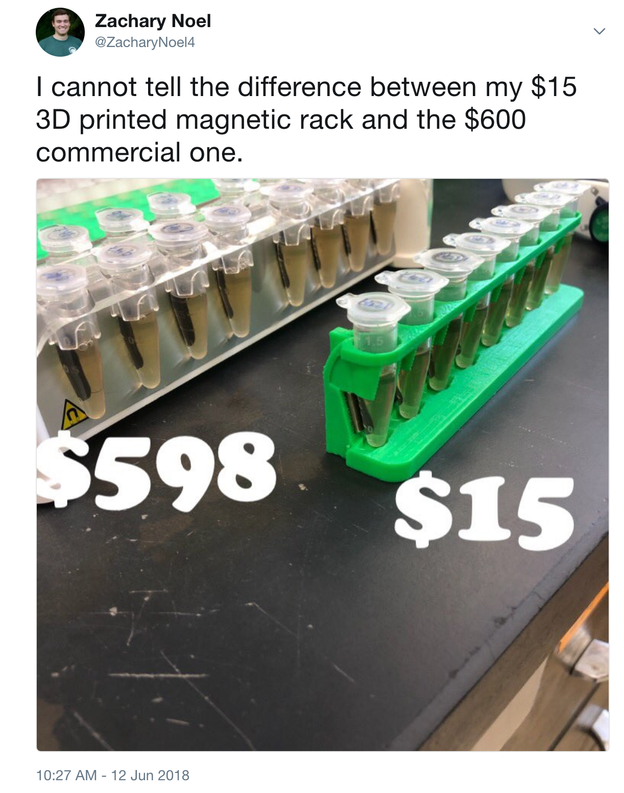

Recently, I tweeted about a science gadget I 3D printed for myself (see link to tweet below)

The tweet gained so much attention, which was unintended. It was great! But I honestly had no idea that this tweet would get almost 70K impressions, 12K engagements, 1K likes and 200 retweets. Twitter has been an exceptional place for scientists, like myself, to get information out quickly, communicate and share cool science tips and tricks. 

This tweet, lead to other scientists joining the conversation about other cool science tools they have printed, including other (arguably better) designs of magnetic racks. Scientist are utilizing 3D printing to make tools they use every day for a fraction of the price of the commercial products. Perhaps the most popular items to print include [magnetic racks for 1.5 ml tubes](https://www.thingiverse.com/search?q=magnetic+rack) and [96 well plates](https://www.thingiverse.com/thing:79430) along with [gel combs](https://www.thingiverse.com/search?q=gel+combs&dwh=725b2e6060259b1). However, just by browsing 3D printing websites like [thingyverse.com](https://www.thingiverse.com/) and the NIH [3D printing archive](https://3dprint.nih.gov/). Scientists, with the know-how and access to a 3D printer are making all kinds of things, including their own [pipettors...](https://www.thingiverse.com/thing:159052) (not sure if I'd trust these...). Another PhD student in our lab even coded and printed a very specific gadget to perform an experiment involving nematodes and fungal spores. Had the experiment worked, this 3D printed tool would have been instrumental in the experimental methods, and he likely would have had to provide the design for a publication. 

Regardless, being unfamiliar of what to do with a tweet that was going, what I’m going to call ‘science viral’, I started replying to everyone asking me questions, mostly about where I got the design or how I got access to the 3D printer. I quickly learned that I did not actually have to reply to everyone, but instead thought I would write this blog post to point people in the correct direction to start printing gadgets for themselves. Keep in mind, I am a PhD student in Plant Pathology with an Ecology and Evolutionary Biology focus. I am not an engineer or an expert in 3D printing. I simply know how to utilize the resources at hand to my advantage, something that as a graduate student should be part of the job description. But, by the popularity of this tweet, I began to realize that not everyone knew that 3D printing lab equipment was an option or felt like access to 3D printers was limited or assumed my lab bought a 3D printer to print lab equipment, sarcastically alluding to labs with lots of money to spend on 3D printers. I’m here to write about my story into 3D printing, how to do it, how it is possible for everyone, even with limited direct access to 3D printers. 

To get started 3D printing, the first thing is to find a 3D printer. I got a question on my tweet about if the cost I reported included the cost of the 3D printer and software to print. I replied to this by explaining that it did not include the cost of the printer itself or the software. The cost of a 3D printer and software was avoided by utilizing 3D printers the Michigan State University had in the library. By utilizing this resource, I did not have to write any code, design the magnetic rack or touch a 3D printer. Literally, all I did was download the .STL file from thingyverse.com and submitted the design to the MSU library. They had it printed and ready to pick up the following day for about $6.50. I know, from following other spin offs of this tweet, others did this at their own universities. So, the university fronted the cost of buying the 3D printer and the price I experienced was $6.50 to print. The magnets cost a little more, which you can buy here: [https://www.kjmagnetics.com/proddetail.asp?prod=B842](https://www.kjmagnetics.com/proddetail.asp?prod=B842). But overall, this cost was something I, on my limited graduate student salary, didn’t mind paying for myself. 

For others that do not have direct access to a 3D printer on campus, I’m sure by doing a simple google search, there are plenty of 3D printing services you can utilize where they will just ship you the product when your gadget is printed. There are even people that are printing and selling gadgets on ebay! [link here](https://www.ebay.com/itm/273014243549) 

Point is, 3D printed lab gadgets are for everyone, even for individuals without direct access to a 3D printer, or without the coding or engineering know-how to make your own designs. Although, I’ve looked into it and it's really not hard. The design that was 3D printed for the nematode experiment was coded and designed using free software and an online interface to do some file conversion. But, if you don’t need to design something specific for your experiment, leave the computer work to the professionals, browse premade designs, find the one you like, and find someone who will print it for you. This way, you can spend more time doing more cool science that will not break the bank! 
